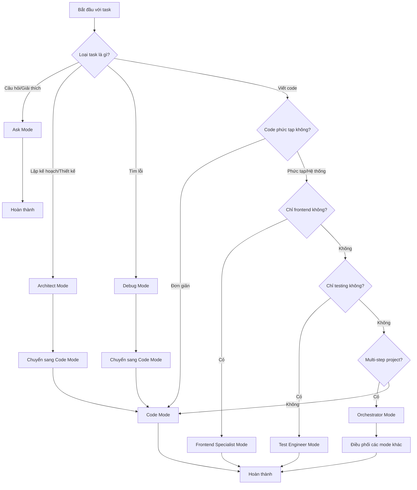

# Hướng Dẫn Sử Dụng Kilo Code

Tài liệu toàn diện về việc sử dụng Kilo Code cho dự án Next.js Supabase Template này.

## 📋 Mục Lục

1. [Giới thiệu về Kilo Code](#giới-thiệu-về-kilo-code)
2. [Hướng dẫn nhanh (Quick Start)](#hướng-dẫn-nhanh-quick-start)
3. [Hướng dẫn chi tiết theo từng loại task](#hướng-dẫn-chi-tiết-theo-từng-loại-task)
4. [Mode Selection Guide](#mode-selection-guide)
5. [Integration với dự án](#integration-với-dự-án)
6. [Troubleshooting](#troubleshooting)
7. [Tips and Best Practices](#tips-and-best-practices)

## 🚀 Giới thiệu về Kilo Code

Kilo Code là một hệ thống AI hỗ trợ phát triển phần mềm được thiết kế để tăng năng suất và đảm bảo chất lượng code trong dự án Next.js Supabase Template này.

### Vai trò trong dự án

Kilo Code đóng vai trò như một **trợ lý phát triển thông minh** với các chức năng chính:

- **Phân tích yêu cầu** và đề xuất giải pháp phù hợp với kiến trúc hiện tại
- **Tự động hóa** các tác vụ phát triển lặp đi lặp lại
- **Đảm bảo tuân thủ** các quy tắc và patterns đã định nghĩa
- **Hỗ trợ debugging** và tối ưu hóa code
- **Tạo tài liệu** và examples tự động

### Nguyên tắc hoạt động

Kilo Code hoạt động dựa trên nguyên tắc **"Docs first, code second"** - luôn ưu tiên nghiên cứu tài liệu trước khi triển khai code.

## 🏃‍♂️ Hướng dẫn nhanh (Quick Start)

### Cách khởi tạo Kilo Code cho dự án

1. **Mở terminal** và di chuyển đến thư mục dự án:
   ```bash
   cd /path/to/nextjs-supabase-template
   ```

2. **Khởi động Kilo Code** với mode phù hợp:
   ```bash
   # Cho các tác vụ phát triển chung
   kilo-code --mode code
   
   # Cho lập kế hoạch và thiết kế
   kilo-code --mode architect
   
   # Cho giải thích và tài liệu
   kilo-code --mode ask
   ```

3. **Cấu hình ban đầu** (lần đầu tiên):
   - Chỉ định thư mục dự án
   - Chọn ngôn ngữ (Vietnamese)
   - Xác nhận các quy tắc dự án

### Quy trình cơ bản để thực hiện một task

#### Bước 1: Nghiên cứu tài liệu (Bắt buộc)

Trước khi thực hiện bất kỳ tác vụ nào, Kilo Code sẽ tự động:

1. **Đọc các file tài liệu cốt lõi**:
   - [`docs/architecture.md`](../docs/architecture.md) - Hiểu kiến trúc tổng thể
   - [`docs/development-workflow.md`](../docs/development-workflow.md) - Nắm quy trình phát triển
   - [`docs/getting-started.md`](../docs/getting-started.md) - Các bước thiết lập ban đầu
   - [`docs/quick-reference.md`](../docs/quick-reference.md) - Tham khảo nhanh

2. **Đọc tài liệu chuyên sâu** dựa trên loại tác vụ:
   - **Tác vụ AI**: [`docs/ai-module-guide.md`](../docs/ai-module-guide.md)
   - **Database**: [`docs/migration-guide.md`](../docs/migration-guide.md)
   - **State management**: [`docs/zustand-usage.md`](../docs/zustand-usage.md)

#### Bước 2: Phân tích yêu cầu

Kilo Code sẽ:
- Xác định rõ loại tác vụ (feature, bug fix, refactoring)
- Phân tích dependencies và tác động
- Đề xuất approach phù hợp

#### Bước 3: Lập kế hoạch

Tạo kế hoạch chi tiết:
- Chia nhỏ công việc thành các bước cụ thể
- Xác định thứ tự ưu tiên
- Dự kiến thời gian hoàn thành

#### Bước 4: Triển khai

- Viết code tuân thủ patterns và best practices
- Sử dụng các components và utilities đã có
- Đảm bảo type safety với TypeScript

#### Bước 5: Testing và Validation

- Tạo unit tests cho code mới
- Chạy linting và type checking
- Kiểm tra integration với hệ thống hiện tại

### Ví dụ thực tế với một task đơn giản

#### Yêu cầu: Thêm component UserCard để hiển thị thông tin user

**1. Nghiên cứu tài liệu:**
```bash
# Kilo Code tự động đọc các file cần thiết
- docs/architecture.md → Hiểu cấu trúc components
- docs/quick-reference.md → Xem component patterns
- src/components/ui/ → Tìm UI components có sẵn
```

**2. Phân tích:**
- Cần tạo component mới trong `src/components/features/`
- Sử dụng Shadcn UI components đã có
- Tuân thủ TypeScript patterns

**3. Kế hoạch:**
- Tạo file `src/components/features/user-card.tsx`
- Sử dụng Card, Avatar từ `src/components/ui/`
- Thêm props với TypeScript interface
- Export trong index file

**4. Triển khai:**
```typescript
// src/components/features/user-card.tsx
'use client'

import { Avatar, AvatarFallback, AvatarImage } from '@/components/ui/avatar'
import { Card, CardContent, CardHeader, CardTitle } from '@/components/ui/card'
import { Badge } from '@/components/ui/badge'

interface UserCardProps {
  user: {
    id: string
    name: string
    email: string
    avatar?: string
    role?: string
  }
  className?: string
}

export function UserCard({ user, className }: UserCardProps) {
  return (
    <Card className={className}>
      <CardHeader className="flex flex-row items-center space-y-0 pb-2">
        <Avatar className="h-8 w-8">
          <AvatarImage src={user.avatar} alt={user.name} />
          <AvatarFallback>
            {user.name.charAt(0).toUpperCase()}
          </AvatarFallback>
        </Avatar>
        <CardTitle className="ml-2 text-sm">{user.name}</CardTitle>
        {user.role && (
          <Badge variant="secondary" className="ml-auto">
            {user.role}
          </Badge>
        )}
      </CardHeader>
      <CardContent>
        <p className="text-sm text-muted-foreground">{user.email}</p>
      </CardContent>
    </Card>
  )
}
```

**5. Testing:**
```typescript
// tests/components/user-card.test.tsx
import { render, screen } from '@testing-library/react'
import { UserCard } from '@/components/features/user-card'

describe('UserCard', () => {
  it('renders user information correctly', () => {
    const user = {
      id: '1',
      name: 'John Doe',
      email: 'john@example.com',
      role: 'Admin'
    }
    
    render(<UserCard user={user} />)
    
    expect(screen.getByText('John Doe')).toBeInTheDocument()
    expect(screen.getByText('john@example.com')).toBeInTheDocument()
    expect(screen.getByText('Admin')).toBeInTheDocument()
  })
})
```

## 📝 Hướng dẫn chi tiết theo từng loại task

### Feature Development

#### Quy trình

1. **Nghiên cứu requirements và kiến trúc**
   - Đọc [`docs/architecture.md`](../docs/architecture.md) để hiểu vị trí của feature
   - Kiểm tra các features tương tự đã tồn tại
   - Xác định impact trên các modules khác

2. **Thiết kế solution**
   - Vạch ra data flow
   - Xác định components cần thiết
   - Lựa chọn appropriate patterns

3. **Implementation**
   - Tạo database schema (nếu cần)
   - Implement API routes
   - Tạo UI components
   - Kết nối với state management

4. **Integration testing**
   - Test với các features hiện có
   - Verify data flow
   - Test edge cases

#### Best Practices

- **Component Structure**:
  ```typescript
  // ✅ Good: Clean component structure
  interface FeatureComponentProps {
    // Clear prop definitions
  }
  
  export function FeatureComponent({ prop }: FeatureComponentProps) {
    // Hooks first
    // Event handlers
    // Return JSX
  }
  ```

- **Data Fetching**:
  ```typescript
  // ✅ Good: Use TanStack Query
  const { data, isLoading, error } = useQuery({
    queryKey: ['feature-data'],
    queryFn: () => fetchFeatureData()
  })
  ```

- **Error Handling**:
  ```typescript
  // ✅ Good: Proper error boundaries
  try {
    const result = await operation()
    return result
  } catch (error) {
    console.error('Operation failed:', error)
    throw new Error('Failed to complete operation')
  }
  ```

### Bug Fixes

#### Quy trình

1. **Issue Analysis**
   - Reproduce the bug
   - Identify root cause
   - Determine scope of impact

2. **Research**
   - Check if similar bugs were fixed before
   - Review related documentation
   - Understand the expected behavior

3. **Fix Implementation**
   - Write minimal, targeted fix
   - Add tests to prevent regression
   - Document the fix

4. **Verification**
   - Test the fix thoroughly
   - Verify no side effects
   - Update documentation if needed

#### Best Practices

- **Reproduction First**:
  ```bash
  # Always create reproduction case
  npm run test -- --grep "reproduction-case"
  ```

- **Minimal Changes**:
  ```typescript
  // ✅ Good: Fix only what's broken
  const calculateTotal = (items: Item[]) => {
    // Fix the calculation logic
    return items.reduce((sum, item) => sum + item.price, 0)
  }
  ```

- **Regression Tests**:
  ```typescript
  // ✅ Good: Test to prevent regression
  describe('Bug Fix #123', () => {
    it('should calculate total correctly with zero items', () => {
      const result = calculateTotal([])
      expect(result).toBe(0)
    })
  })
  ```

### Refactoring

#### Quy trình

1. **Analysis**
   - Identify code smells
   - Measure current performance
   - Plan refactoring strategy

2. **Preparation**
   - Ensure comprehensive test coverage
   - Create baseline measurements
   - Document current behavior

3. **Execution**
   - Make small, incremental changes
   - Run tests after each change
   - Maintain functionality throughout

4. **Validation**
   - Compare with baseline
   - Verify performance improvements
   - Update documentation

#### Best Practices

- **Small Steps**:
  ```typescript
  // ❌ Bad: Large refactoring at once
  function refactorEverything() {
    // 100 lines of changes
  }
  
  // ✅ Good: Incremental refactoring
  function extractHelper() {
    // 10 lines of changes
  }
  
  function improveNaming() {
    // 5 lines of changes
  }
  ```

- **Test Coverage**:
  ```bash
  # Ensure high coverage before refactoring
  npm run test:coverage -- --threshold 90
  ```

### Testing

#### Quy trình

1. **Test Planning**
   - Identify test scenarios
   - Choose appropriate test types
   - Plan test data

2. **Implementation**
   - Write unit tests first
   - Add integration tests
   - Create E2E tests for critical paths

3. **Maintenance**
   - Keep tests updated
   - Monitor test performance
   - Regular test reviews

#### Best Practices

- **Test Structure**:
  ```typescript
  // ✅ Good: Clear test structure
  describe('ComponentName', () => {
    describe('when props have specific values', () => {
      it('should render correctly', () => {
        // Test implementation
      })
    })
    
    describe('when user interacts', () => {
      it('should handle events', () => {
        // Test implementation
      })
    })
  })
  ```

- **Test Data**:
  ```typescript
  // ✅ Good: Reusable test data
  const createMockUser = (overrides = {}) => ({
    id: '1',
    name: 'Test User',
    email: 'test@example.com',
    ...overrides
  })
  ```

## 🎯 Mode Selection Guide

### Mô tả chi tiết từng mode và khi nào nên sử dụng

#### 1. Code Mode
**Mục đích**: Viết, sửa, và refactor code
**Khi sử dụng**:
- Implementing new features
- Fixing bugs
- Code refactoring
- Writing tests

**Đặc điểm**:
- Truy cập trực tiếp vào file system
- Có thể đọc và ghi file
- Chạy các lệnh hệ thống
- Tích hợp với development tools

**Ví dụ sử dụng**:
```
Task: Thêm authentication cho API routes
Mode: Code
Reason: Cần implement code và tạo files mới
```

#### 2. Architect Mode
**Mục đích**: Lập kế hoạch, thiết kế hệ thống
**Khi sử dụng**:
- System architecture design
- Feature planning
- Technical specification creation
- Complex problem decomposition

**Đặc điểm**:
- Tập trung vào planning và design
- Không thay đổi code trực tiếp
- Tạo tài liệu và diagrams
- Phân tích dependencies

**Ví dụ sử dụng**:
```
Task: Thiết kế hệ thống notification
Mode: Architect
Reason: Cần phân tích requirements và thiết kế architecture trước khi implement
```

#### 3. Ask Mode
**Mục đích**: Giải thích, trả lời câu hỏi, tạo tài liệu
**Khi sử dụng**:
- Code explanation
- Documentation creation
- Technical questions
- Learning and research

**Đặc điểm**:
- Chỉ đọc file, không ghi
- Tập trung vào phân tích và giải thích
- Tạo documentation
- Trả lời câu hỏi kỹ thuật

**Ví dụ sử dụng**:
```
Task: Giải thích cách AI module hoạt động
Mode: Ask
Reason: Cần phân tích và giải thích, không thay đổi code
```

#### 4. Debug Mode
**Mục đích**: Tìm và sửa lỗi
**Khi sử dụng**:
- Troubleshooting issues
- Performance debugging
- Error analysis
- Root cause investigation

**Đặc điểm**:
- Phân tích systematic
- Thêm logging để debug
- Test hypotheses
- Verify fixes

**Ví dụ sử dụng**:
```
Task: Tìm nguyên nhân memory leak
Mode: Debug
Reason: Cần phân tích systematic và test các hypotheses
```

#### 5. Frontend Specialist Mode
**Mục đích**: Chuyên về frontend development
**Khi sử dụng**:
- UI/UX implementation
- Component development
- Styling and responsive design
- Frontend optimization

**Đặc điểm**:
- Chỉ làm việc với frontend files
- Chuyên sâu về React, TypeScript, CSS
- Tối ưu performance frontend
- Tuân thủ design system

**Ví dụ sử dụng**:
```
Task: Tạo responsive dashboard layout
Mode: Frontend Specialist
Reason: Cần chuyên môn về frontend và responsive design
```

#### 6. Test Engineer Mode
**Mục đích**: Viết và quản lý tests
**Khi sử dụng**:
- Test planning and implementation
- Test automation
- Coverage analysis
- Test maintenance

**Đặc điểm**:
- Chuyên sâu về testing strategies
- Viết comprehensive tests
- Tối ưu test performance
- Monitor test quality

**Ví dụ sử dụng**:
```
Task: Tăng test coverage lên 90%
Mode: Test Engineer
Reason: Cần chuyên môn về testing và coverage analysis
```

#### 7. Orchestrator Mode
**Mục đích**: Điều phối các task phức tạp
**Khi sử dụng**:
- Multi-step projects
- Cross-functional coordination
- Complex workflow management
- Project oversight

**Đặc điểm**:
- Chia nhỏ task lớn
- Điều phối các mode khác
- Theo dõi tiến độ
- Đảm bảo integration

**Ví dụ sử dụng**:
```
Task: Triển khai feature từ A-Z
Mode: Orchestrator
Reason: Cần điều phối multiple modes và track tiến độ
```

### Flowchart quyết định chọn mode



### Ví dụ thực tế với từng mode

#### Example 1: Implementing User Authentication

**Step 1: Architect Mode**
```
Task: Design authentication system
Output:
- Authentication flow diagram
- Database schema design
- API endpoint specifications
- Security considerations
```

**Step 2: Code Mode**
```
Task: Implement authentication
Output:
- Database migrations
- API routes implementation
- Frontend components
- Integration tests
```

**Step 3: Test Engineer Mode**
```
Task: Test authentication thoroughly
Output:
- Unit tests for auth functions
- Integration tests for API
- E2E tests for user flows
- Security tests
```

#### Example 2: Debugging Performance Issue

**Step 1: Debug Mode**
```
Task: Investigate slow page load
Process:
- Add performance logging
- Analyze bundle size
- Check database queries
- Identify bottleneck
```

**Step 2: Code Mode**
```
Task: Fix performance issues
Changes:
- Optimize images
- Implement lazy loading
- Add database indexes
- Cache API responses
```

#### Example 3: Creating Documentation

**Ask Mode**
```
Task: Create API documentation
Process:
- Analyze API routes
- Extract endpoint information
- Generate documentation
- Create examples
```

## 🔗 Integration với dự án

### Cách sử dụng các scripts có sẵn

Dự án này include nhiều utility scripts trong thư mục [`scripts/`](../scripts/) để tự động hóa các tác vụ phổ biến:

#### Development Scripts

```bash
# Setup development environment
./scripts/dev-setup.sh

# Reset và seed database
./scripts/db-reset.sh --seed

# Generate TypeScript types
./scripts/types-generate.sh

# Fix linting issues
./scripts/lint-fix.sh
```

#### Testing Scripts

```bash
# Run tests với coverage
./scripts/test-coverage.sh --threshold 85

# Run E2E tests
./scripts/test-coverage.sh --e2e-only

# Generate test report
./scripts/test-coverage.sh --output-format html
```

#### AI Scripts

```bash
# Test AI providers
./scripts/ai-test-providers.sh --all

# Generate usage report
./scripts/ai-usage-report.sh --report-type cost

# Clear AI cache
./scripts/ai-cache-clear.sh --all
```

#### Deployment Scripts

```bash
# Deploy to staging
./scripts/deploy.sh --platform vercel --environment staging

# Deploy to production
./scripts/deploy.sh --platform vercel --environment production

# Analyze bundle before deploy
./scripts/bundle-analyze.sh --threshold 5
```

### Cách tuân thủ quy trình code quality

#### 1. Pre-commit Hooks

Sử dụng Husky để đảm bảo quality trước khi commit:

```bash
# Install hooks
npm run husky:install

# Pre-commit checks tự động:
- ESLint fixing
- TypeScript checking
- Prettier formatting
- Test running
```

#### 2. Code Quality Commands

```bash
# Kiểm tra type safety
npm run type-check

# Fix linting issues
npm run lint:fix

# Format code
npm run format

# Run quality check suite
npm run quality:check
```

#### 3. Quality Gates

```bash
# Bundle size analysis
./scripts/bundle-analyze.sh --threshold 5

# Security audit
npm audit

# Performance testing
./scripts/test-coverage.sh --performance
```

### Cách làm việc với hệ thống testing

#### Test Structure

```
tests/
├── components/          # Component unit tests
├── api/               # API route tests
├── hooks/             # Hook tests
├── utils/             # Utility function tests
├── integration/        # Integration tests
└── e2e/              # End-to-end tests
```

#### Running Tests

```bash
# Unit tests
npm run test

# Watch mode
npm run test:watch

# Coverage
npm run test:coverage

# E2E tests
npm run test:e2e

# All tests
npm run test:all
```

#### Writing Tests

**Component Tests**:
```typescript
// tests/components/example.test.tsx
import { render, screen } from '@testing-library/react'
import { ExampleComponent } from '@/components/example'

describe('ExampleComponent', () => {
  it('renders correctly', () => {
    render(<ExampleComponent />)
    expect(screen.getByText('Example')).toBeInTheDocument()
  })
})
```

**API Tests**:
```typescript
// tests/api/example.test.ts
import { createApp } from '@/app/api/example/route'
import { NextRequest } from 'next/server'

describe('/api/example', () => {
  it('returns correct response', async () => {
    const request = new Request('http://localhost:3000/api/example')
    const response = await createApp(request)
    
    expect(response.status).toBe(200)
  })
})
```

## 🔧 Troubleshooting

### Các vấn đề thường gặp và cách giải quyết

#### 1. "Docs first rule violation"

**Problem**: Bắt đầu implement mà không đọc docs
**Solution**:
```bash
# Luôn bắt đầu với reading docs
kilo-code --mode ask --task "research architecture for feature X"

# Sau đó mới implement
kilo-code --mode code --task "implement feature X"
```

#### 2. TypeScript errors

**Problem**: Type errors không rõ nguyên nhân
**Solution**:
```bash
# Kiểm tra types
npm run type-check

# Generate types từ database
./scripts/types-generate.sh

# Fix imports và paths
npm run lint:fix
```

#### 3. Build failures

**Problem**: Build failed trong production
**Solution**:
```bash
# Clean build
rm -rf .next

# Check environment variables
npm run env:check

# Analyze bundle
./scripts/bundle-analyze.sh

# Build locally
npm run build
```

#### 4. Database connection issues

**Problem**: Không kết nối được với Supabase
**Solution**:
```bash
# Check environment
echo $NEXT_PUBLIC_SUPABASE_URL

# Test connection
./scripts/db-test.sh

# Reset types
./scripts/types-generate.sh --force
```

#### 5. AI module not working

**Problem**: AI services không hoạt động
**Solution**:
```bash
# Test providers
./scripts/ai-test-providers.sh --all

# Check API keys
./scripts/ai-test-providers.sh --provider openai --test-type connectivity

# Clear cache
./scripts/ai-cache-clear.sh --all
```

### Khi nào cần chuyển mode và cách chuyển

#### 1. Từ Code sang Architect

**Khi**: Task phức tạp hơn dự kiến
```bash
# Dừng implement
git stash

# Chuyển mode
kilo-code --mode architect --task "redesign feature X"

# Sau khi có design, quay lại code
kilo-code --mode code --task "implement redesigned feature X"
```

#### 2. Từ Code sang Debug

**Khi**: Gặp lỗi khó hiểu
```bash
# Add debugging
kilo-code --mode debug --task "investigate error in feature X"

# Sau khi tìm ra nguyên nhân
kilo-code --mode code --task "fix identified issue"
```

#### 3. Từ bất kỳ mode sang Ask

**Khi**: Cần clarification hoặc documentation
```bash
kilo-code --mode ask --task "explain how Y works"
```

### Cách xử lý conflicts với quy trình hiện có

#### 1. Conflict với existing patterns

**Problem**: Code mới không tuân thủ patterns
**Solution**:
1. Dừng implement
2. Đọc lại documentation liên quan
3. Sử dụng patterns có sẵn
4. Tạo custom pattern nếu cần thiết

#### 2. Conflict với team workflow

**Problem**: Cách làm việc không phù hợp với team
**Solution**:
1. Review [`docs/development-workflow.md`](../docs/development-workflow.md)
2. Điều chỉnh approach để phù hợp
3. Communicate với team về changes
4. Update documentation nếu cần

#### 3. Conflict với tooling

**Problem**: Tools không hoạt động như mong đợi
**Solution**:
```bash
# Check tool versions
npm list --depth=0

# Update dependencies
npm update

# Re-run setup
./scripts/dev-setup.sh
```

## 💡 Tips and Best Practices

### Các tips để làm việc hiệu quả với Kilo Code

#### 1. Preparation is Key

- **Luôn đọc docs first** - Đây là rule quan trọng nhất
- **Start with Ask mode** khi không chắc chắn
- **Use Architect mode** cho complex features
- **Plan before implement**

#### 2. Incremental Development

- **Small, frequent commits**
- **Test after each change**
- **Use feature flags** cho incomplete features
- **Regular integration checks**

#### 3. Communication

- **Clear task descriptions**
- **Specific requirements**
- **Regular progress updates**
- **Ask for clarification** khi cần

#### 4. Quality First

- **Never skip tests**
- **Always run linting**
- **Check types before commit**
- **Review before merge**

### Best practices cho từng loại task

#### Feature Development

1. **Research Phase**:
   ```bash
   # Đọc tất cả docs liên quan
   kilo-code --mode ask --task "research similar features"
   
   # Hiểu impact analysis
   kilo-code --mode architect --task "analyze feature impact"
   ```

2. **Design Phase**:
   ```bash
   # Tạo technical specification
   kilo-code --mode architect --task "design feature X"
   ```

3. **Implementation Phase**:
   ```bash
   # Implement theo design
   kilo-code --mode code --task "implement feature X"
   ```

4. **Testing Phase**:
   ```bash
   # Comprehensive testing
   kilo-code --mode test-engineer --task "test feature X"
   ```

#### Bug Fixes

1. **Reproduction**:
   ```bash
   # Create reproduction case
   kilo-code --mode debug --task "reproduce bug Y"
   ```

2. **Root Cause Analysis**:
   ```bash
   # Find root cause
   kilo-code --mode debug --task "analyze bug Y"
   ```

3. **Fix Implementation**:
   ```bash
   # Implement minimal fix
   kilo-code --mode code --task "fix bug Y"
   ```

4. **Regression Testing**:
   ```bash
   # Prevent regression
   kilo-code --mode test-engineer --task "regression test for bug Y"
   ```

#### Refactoring

1. **Analysis**:
   ```bash
   # Analyze current code
   kilo-code --mode ask --task "analyze code smell in module Z"
   ```

2. **Planning**:
   ```bash
   # Plan refactoring
   kilo-code --mode architect --task "plan refactoring of module Z"
   ```

3. **Execution**:
   ```bash
   # Incremental refactoring
   kilo-code --mode code --task "refactor module Z step 1"
   ```

4. **Validation**:
   ```bash
   # Verify improvements
   kilo-code --mode debug --task "validate refactoring of module Z"
   ```

#### Testing

1. **Test Planning**:
   ```bash
   # Plan test strategy
   kilo-code --mode test-engineer --task "plan tests for feature X"
   ```

2. **Implementation**:
   ```bash
   # Write tests
   kilo-code --mode test-engineer --task "implement tests for feature X"
   ```

3. **Maintenance**:
   ```bash
   # Update tests
   kilo-code --mode test-engineer --task "update tests for feature X changes"
   ```

### Cách tối ưu hóa quy trình làm việc

#### 1. Automation

```bash
# Tạo aliases cho common commands
alias kc-research="kilo-code --mode ask"
alias kc-plan="kilo-code --mode architect"
alias kc-code="kilo-code --mode code"
alias kc-test="kilo-code --mode test-engineer"
alias kc-debug="kilo-code --mode debug"
```

#### 2. Template Usage

```bash
# Sử dụng task templates
kilo-code --mode code --task "implement [feature-name] using template: user-crud"
```

#### 3. Integration with IDE

- Cài đặt Kilo Code extension cho VS Code
- Sử dụng keyboard shortcuts
- Tạo custom snippets

#### 4. Workflow Optimization

```bash
# Daily workflow
./scripts/dev-setup.sh                    # Morning setup
npm run dev                              # Start development
./scripts/test-coverage.sh --watch         # Run tests in background
./scripts/lint-fix.sh                    # Fix issues as they appear
```

#### 5. Documentation Maintenance

- Update docs sau mỗi feature
- Review docs định kỳ
- Keep examples current
- Document decisions

---

## 📚 Additional Resources

### Documentation References

- [Architecture Guide](../docs/architecture.md) - System architecture overview
- [Development Workflow](../docs/development-workflow.md) - Complete development process
- [Quick Reference](../docs/quick-reference.md) - Common patterns and commands
- [AI Module Guide](../docs/ai-module-guide.md) - AI integration details
- [Scripts Guide](../docs/scripts-guide.md) - Utility scripts documentation

### Troubleshooting Resources

- [Troubleshooting Guide](../docs/troubleshooting.md) - Common issues and solutions
- [Migration Guide](../docs/migration-guide.md) - Database migration help
- [Getting Started](../docs/getting-started.md) - Setup and configuration

### Community & Support

- GitHub Issues - Bug reports and feature requests
- Documentation - Comprehensive guides and references
- Examples - Real-world implementation examples

---

**Lưu ý quan trọng**: Luôn tuân thủ nguyên tắc **"Docs first, code second"** khi làm việc với Kilo Code trong dự án này. Đây là chìa khóa để đảm bảo chất lượng và tính nhất quán của codebase.

Happy coding with Kilo Code! 🚀