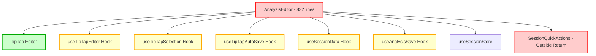
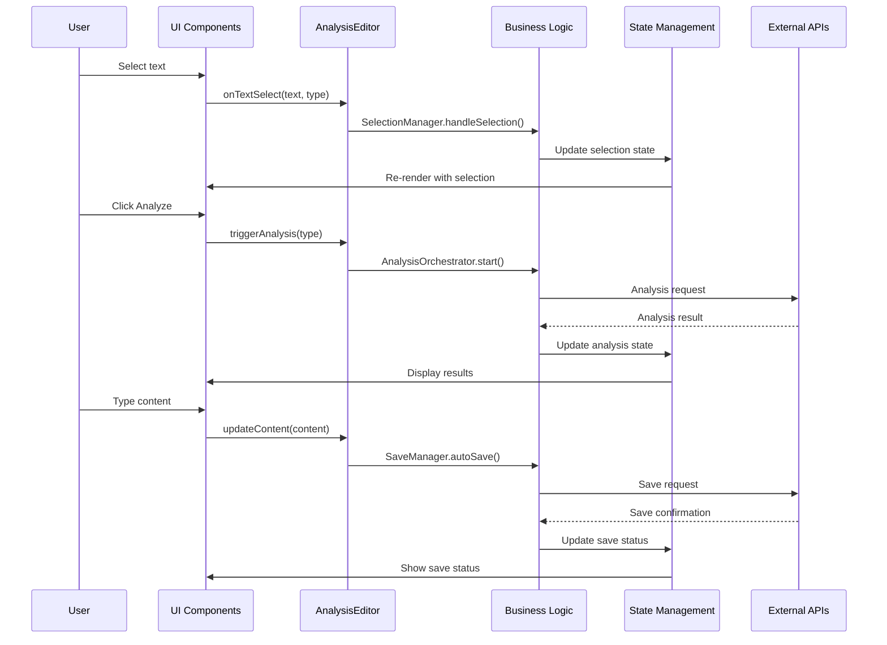
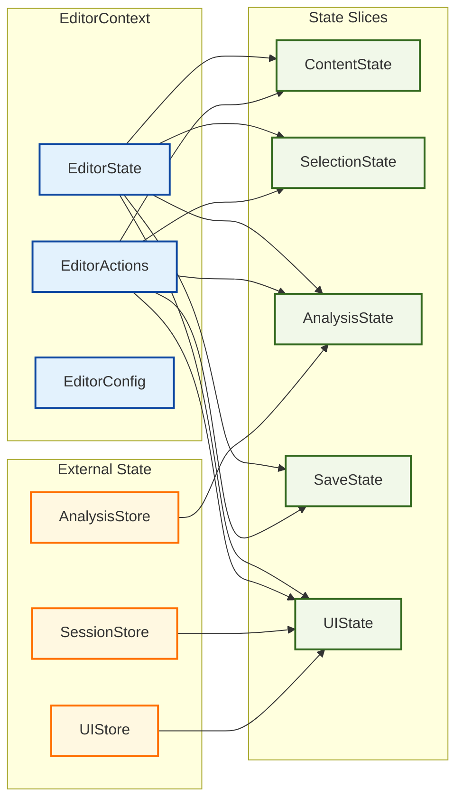
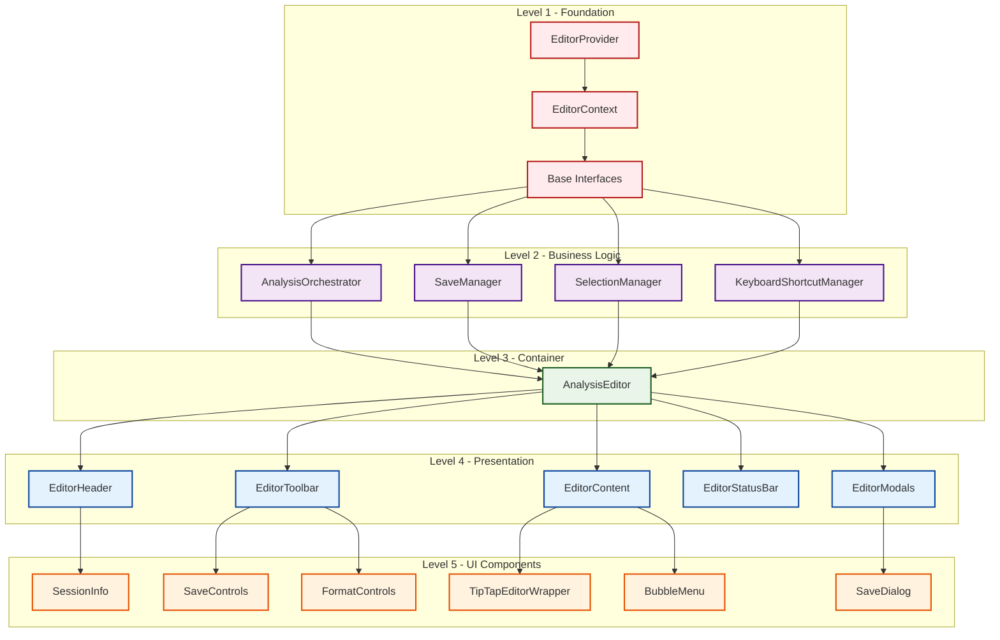
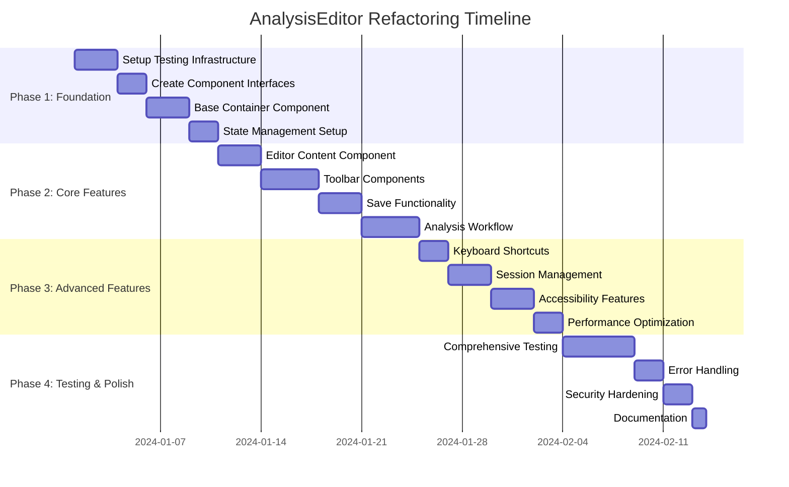

# AnalysisEditor Component Architecture Diagram

## Current vs Proposed Architecture

### Current Architecture (Problems)

**Issues Identified:**
- 🔴 Single component with 832 lines
- 🔴 SessionQuickActions rendered outside return statement
- 🟡 Too many hooks creating complex dependencies
- 🔴 Mixed concerns (UI, business logic, state management)

### Proposed Architecture (Solution)

```mermaid
graph TD
    subgraph "Container Layer"
        A[AnalysisEditor Container]
        AP[EditorProvider]
    end
    
    subgraph "Presentation Layer"
        B[EditorHeader]
        C[EditorToolbar]
        D[EditorContent]
        E[EditorStatusBar]
        F[EditorModals]
    end
    
    subgraph "Business Logic Layer"
        G[AnalysisOrchestrator]
        H[SaveManager]
        I[KeyboardShortcutManager]
        J[SelectionManager]
    end
    
    subgraph "State Management"
        K[EditorContext]
        L[Content State]
        M[Selection State]
        N[Analysis State]
        O[Session State]
    end
    
    subgraph "UI Components"
        P[SessionInfo]
        Q[BreadcrumbNavigation]
        R[QuickActions]
        S[SaveControls]
        T[FormatControls]
        U[SelectionControls]
        V[HighlightControls]
        W[TextStats]
        X[SaveStatus]
        Y[AnalysisButton]
        Z[TipTapEditorWrapper]
        AA[BubbleMenu]
        BB[SaveToSessionDialog]
        CC[SessionQuickActionsDialog]
        DD[ErrorBoundary]
    end
    
    A --> AP
    A --> B
    A --> C
    A --> D
    A --> E
    A --> F
    
    AP --> K
    K --> L
    K --> M
    K --> N
    K --> O
    
    A --> G
    A --> H
    A --> I
    A --> J
    
    B --> P
    B --> Q
    B --> R
    
    C --> S
    C --> T
    C --> U
    C --> V
    
    D --> Z
    D --> AA
    
    E --> W
    E --> X
    E --> Y
    
    F --> BB
    F --> CC
    F --> DD
    
    classDef container fill:#e1f5fe,stroke:#01579b,stroke-width:2px
    classDef presentation fill:#f3e5f5,stroke:#4a148c,stroke-width:2px
    classDef business fill:#e8f5e8,stroke:#1b5e20,stroke-width:2px
    classDef state fill:#fff3e0,stroke:#e65100,stroke-width:2px
    classDef ui fill:#fce4ec,stroke:#880e4f,stroke-width:2px
    
    class A,AP container
    class B,C,D,E,F presentation
    class G,H,I,J business
    class K,L,M,N,O state
    class P,Q,R,S,T,U,V,W,X,Y,Z,BB,CC,DD ui
```

## Data Flow Architecture

## State Management Flow

## Component Dependencies

## Testing Architecture

```mermaid
graph TD
    subgraph "Test Pyramid"
        A[E2E Tests - 10%]
        B[Integration Tests - 30%]
        C[Unit Tests - 60%]
    end
    
    subgraph "E2E Test Coverage"
        D[Critical User Journeys]
        E[Cross-browser Testing]
        F[Performance Benchmarks]
    end
    
    subgraph "Integration Tests"
        G[Component Integration]
        H[Hook Integration]
        I[API Integration]
        J[State Management]
    end
    
    subgraph "Unit Tests"
        K[Component Rendering]
        L[Business Logic]
        M[Utility Functions]
        N[Event Handlers]
    end
    
    A --> D
    A --> E
    A --> F
    
    B --> G
    B --> H
    B --> I
    B --> J
    
    C --> K
    C --> L
    C --> M
    C --> N
    
    classDef e2e fill:#ffebee,stroke:#c62828,stroke-width:2px
    classDef integration fill:#f3e5f5,stroke:#6a1b9a,stroke-width:2px
    classDef unit fill:#e8f5e8,stroke:#2e7d32,stroke-width:2px
    
    class A,D,E,F e2e
    class B,G,H,I,J integration
    class C,K,L,M,N unit
```

## Migration Path

## Key Benefits of New Architecture

### 🎯 **Separation of Concerns**
- Each component has a single responsibility
- Clear boundaries between UI, business logic, and state
- Easier to understand and maintain

### 🔧 **Maintainability**
- Components under 200 lines each
- Clear dependency hierarchy
- Isolated testing possible

### 🚀 **Performance**
- Targeted re-renders with memoization
- Efficient state management
- Reduced bundle size through tree-shaking

### 🛡️ **Security**
- Input sanitization at boundaries
- Secure error handling
- No data exposure in logs

### ♿ **Accessibility**
- ARIA compliance built-in
- Keyboard navigation support
- Focus management

### 🧪 **Testability**
- 90%+ code coverage achievable
- Unit tests for all business logic
- Integration tests for component interactions

---

*This architecture diagram provides a visual roadmap for the refactoring process and will be updated as we progress through implementation.*