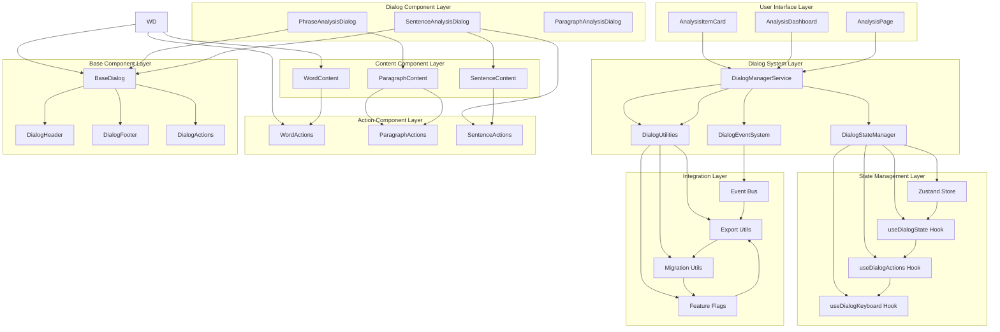
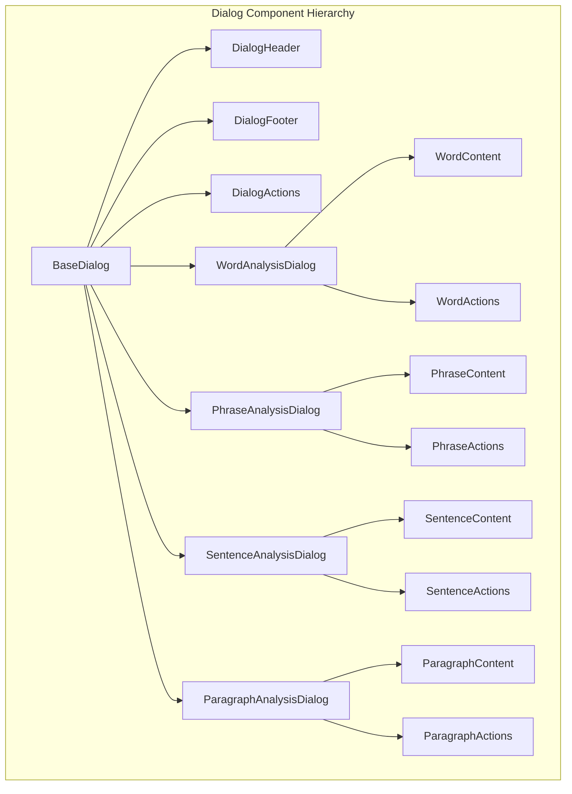
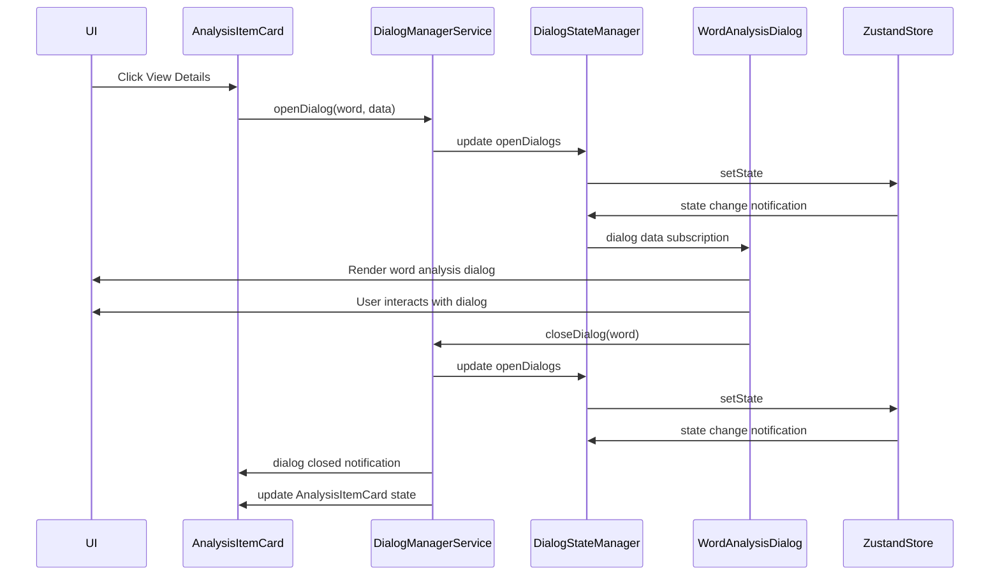
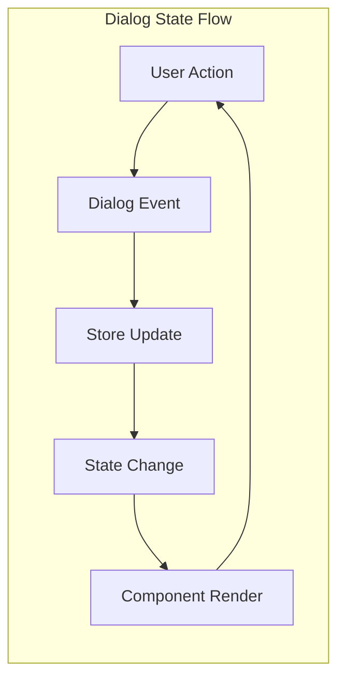
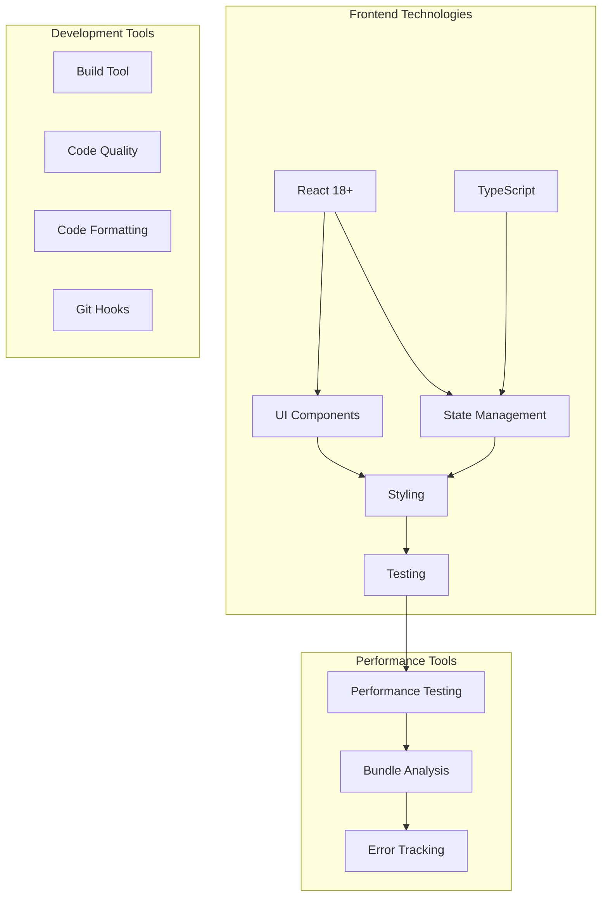

# Dialog System Architecture Diagram

## 1. High-Level Architecture Overview



## 2. Component Hierarchy



## 3. Data Flow Architecture



## 4. State Management Flow



## 5. Integration Flow

```mermaid
graph TD
    subgraph "Integration Flow"
        AIC[AnalysisItemCard]
        DMS[DialogManagerService]
        FF[FeatureFlags]
        LS[LocalStorage]
    end
    
    subgraph "Dialog System Selection"
        NewSystem[New Dialog System]
        LegacySystem[Legacy Dialog System]
    end
    
    AIC --> FF
    FF --> |New System?|
    FF --> NewSystem
    
    NewSystem --> DMS
    LegacySystem --> DMS
    
    DMS --> LS
    LS --> |Migration Data|
    LS --> |Settings Data|
```

## 6. Event System Architecture

```mermaid
graph TD
    subgraph "Event System"
        EB[Event Bus]
        EL[Event Listeners]
        EE[Event Emitters]
    end
    
    subgraph "Event Types"
        OpenEvent[dialog:open]
        CloseEvent[dialog:close]
        UpdateEvent[dialog:data-update]
        ErrorEvent[dialog:error]
        LoadingEvent[dialog:loading]
    end
    
    subgraph "Event Flow"
        ComponentA[Component A]
        ComponentB[Component B]
        Service[Dialog Service]
    end
    
    ComponentA --> EE
    ComponentB --> EL
    Service --> EE
    
    EE --> |OpenEvent|
    EE --> |CloseEvent|
    EE --> |UpdateEvent|
    EE --> |ErrorEvent|
    EE --> |LoadingEvent|
    
    OpenEvent --> ComponentA
    CloseEvent --> ComponentA
    UpdateEvent --> ComponentA
    ErrorEvent --> ComponentA
    LoadingEvent --> ComponentA
    
    OpenEvent --> ComponentB
    CloseEvent --> ComponentB
    UpdateEvent --> ComponentB
    ErrorEvent --> ComponentB
    LoadingEvent --> ComponentB
```

## 7. Performance Architecture

```mermaid
graph TD
    subgraph "Performance Optimization"
        LL[Lazy Loading]
        MEM[Memoization]
        VIRT[Virtualization]
        CS[Code Splitting]
        OPT[State Optimization]
    end
    
    subgraph "Performance Monitoring"
        PM[Performance Metrics]
        ET[Error Tracking]
        AN[Analytics]
    end
    
    LL --> PM
    MEM --> PM
    VIRT --> PM
    CS --> PM
    OPT --> PM
    
    PM --> ET
    PM --> AN
    
    ET --> |Performance Data|
    AN --> |Analytics Data|
```

## 8. Testing Architecture

```mermaid
graph TD
    subgraph "Testing Architecture"
        UT[Unit Tests]
        IT[Integration Tests]
        E2E[E2E Tests]
        MOCK[Mock Data]
        TEST[Testing Utils]
    end
    
    subgraph "Test Coverage"
        Coverage[Coverage Reports]
        CI[CI/CD Pipeline]
        QA[Quality Assurance]
    end
    
    UT --> Coverage
    IT --> Coverage
    E2E --> Coverage
    MOCK --> Coverage
    TEST --> Coverage
    
    Coverage --> CI
    Coverage --> QA
    
    UT --> |Test Results|
    IT --> |Test Results|
    E2E --> |Test Results|
```

## 9. Migration Architecture

```mermaid
graph TD
    subgraph "Migration Strategy"
        LS[Legacy Storage]
        MS[Migration Service]
        NS[New Storage]
        FF[Feature Flags]
    end
    
    subgraph "Migration Process"
        Detect[Detect Legacy State]
        Extract[Extract Data]
        Transform[Transform Data]
        Validate[Validate Data]
        Migrate[Write New State]
        Cleanup[Clean Legacy]
        Verify[Verify Migration]
    end
    
    LS --> Detect
    Detect --> Extract
    Extract --> Transform
    Transform --> Validate
    Validate --> Migrate
    Migrate --> Cleanup
    Cleanup --> Verify
    
    MS --> FF
    FF --> |Migration Enabled?|
    FF --> NS
    
    NS --> |New State|
    LS --> |Legacy State|
```

## 10. Deployment Architecture

```mermaid
graph TD
    subgraph "Deployment Strategy"
        DEV[Development Environment]
        STG[Staging Environment]
        PROD[Production Environment]
    end
    
    subgraph "Feature Rollout"
        FG[Feature Flags]
        AB[A/B Testing]
        CANARY[Canary Release]
        FULL[Full Rollout]
    end
    
    DEV --> FG
    STG --> FG
    PROD --> FG
    
    FG --> |New System?|
    FG --> AB
    AB --> |Test Group|
    AB --> CANARY
    CANARY --> |Small User Group|
    FULL --> |All Users|
```

## 11. Technology Stack



Architecture diagrams này minh họa:
- **Component hierarchy**: Cấu trúc phân cấp rõ ràng
- **Data flow**: Luồng dữ liệu giữa các components
- **State management**: Cách Zustand store quản lý state
- **Event system**: Communication pattern giữa components
- **Integration points**: Cách dialog system kết nối với existing code
- **Performance optimization**: Các chiến lược tối ưu hóa
- **Testing strategy**: Kiến trúc testing toàn diện
- **Migration path**: Cách chuyển đổi từ legacy sang new system
- **Deployment flow**: Quy trình triển khai gradual rollout