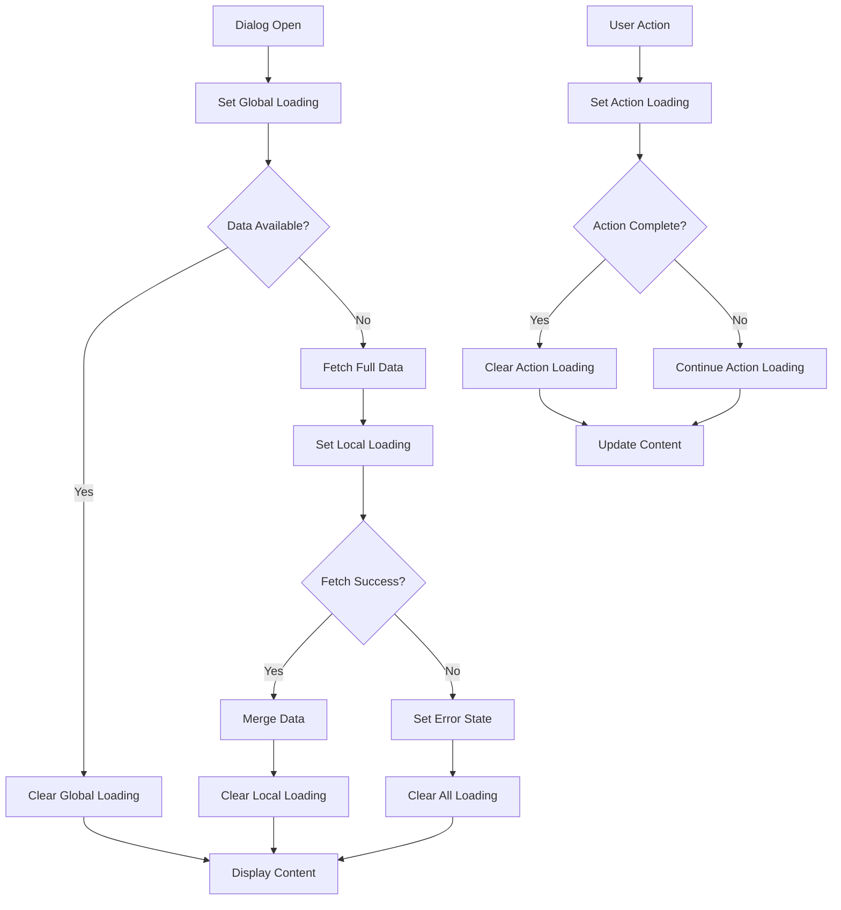

# Kiến Trúc Loading State Cho Dialog Phân Tích

## Tổng Quan

Tài liệu này mô tả kiến trúc chuẩn hóa cho việc quản lý trạng thái loading trong tất cả các dialog phân tích (word, phrase, sentence, paragraph).

## Vấn Đề Hiện Tại

### 1. Nhiều Nguồn Loading Xung Đột
- **Global loading state**: `state.dialogState.loading` trong store
- **Local loading state**: `isFetchingFullData` trong từng component
- **React Query loading**: `isLoading` từ `useSavedAnalysisDetail`
- **Action-specific loading**: Các loading state riêng cho từng hành động

### 2. Xung Đột Giữa Local và Global State
```typescript
// Word Dialog Content
useEffect(() => {
  if (isLoading) {
    setIsFetchingFullData(true);
    actions.setLoading(true);  // Global state
  } else {
    setIsFetchingFullData(false);
    if (mergedAnalysis) {
      actions.setLoading(false);  // Global state
    }
  }
}, [isLoading, mergedAnalysis, actions]);
```

### 3. Không Clear Global Loading Khi Có Lỗi
Khi có lỗi xảy ra, global loading không được clear, dẫn đến:
- Loading indicator hiển thị mãi mãi
- User không thể tương tác với dialog
- Trải nghiệm người dùng kém

### 4. Quá Nhiều Loading Indicators Cùng Lúc
- Loading indicator toàn dialog
- Loading indicator cho việc fetch dữ liệu
- Loading indicator cho các hành động cụ thể
- Skeleton loaders trong content

## Kiến Trúc Mới

### 1. Phân Cấp Loading State

```
┌─────────────────────────────────────────────────────────────┐
│                DIALOG LOADING STATE                 │
├─────────────────────────────────────────────────────────────┤
│                                                 │
│  ┌─────────────────┐  ┌─────────────────┐    │
│  │ GLOBAL STATE   │  │ LOCAL STATES   │    │
│  │                 │  │               │    │
│  │ loading: bool  │  │ fetching: bool │    │
│  │ error: string   │  │ actions: Map   │    │
│  │ message: string │  │               │    │
│  └─────────────────┘  └─────────────────┘    │
│                                                 │
└─────────────────────────────────────────────────────────────┘
```

### 2. Loading State Types

```typescript
interface DialogLoadingState {
  // Global loading state
  isLoading: boolean;
  error: string | null;
  message: string | null;
  
  // Local loading states
  fetching: {
    fullData: boolean;
    relatedData: boolean;
  };
  
  // Action-specific loading states
  actions: {
    pronunciation: boolean;
    addToVocabulary: boolean;
    share: boolean;
    export: boolean;
    analyze: boolean;
  };
  
  // Metadata
  lastUpdated: number;
  source: 'global' | 'local' | 'action';
}
```

### 3. Hook Quản Lý Loading State

```typescript
interface UseDialogLoadingReturn {
  // Global state
  isLoading: boolean;
  error: string | null;
  message: string | null;
  
  // Actions
  setGlobalLoading: (loading: boolean, message?: string) => void;
  setLocalLoading: (key: string, loading: boolean) => void;
  setActionLoading: (action: string, loading: boolean) => void;
  clearError: () => void;
  
  // Computed states
  hasAnyLoading: boolean;
  primaryLoadingSource: string;
}
```

## Quy Tắc Quản Lý Loading State

### 1. Single Source of Truth
- Chỉ sử dụng **một nguồn loading chính** cho toàn bộ dialog
- Các loading state khác phải được đồng bộ hóa với nguồn chính

### 2. Error Handling
- **Luôn clear global loading khi có lỗi**
- Hiển thị error state thay vì loading state khi có lỗi
- Cho phép retry từ error state

### 3. Loading Priority
1. **Action loading** (cao nhất) - Các hành động người dùng
2. **Local loading** (trung bình) - Fetch dữ liệu bổ sung
3. **Global loading** (thấp nhất) - Loading toàn dialog

### 4. Clear Conditions
```typescript
const shouldClearLoading = (
  hasError: boolean,
  hasData: boolean,
  actionCompleted: boolean
) => {
  if (hasError) return true;
  if (hasData && !actionCompleted) return true;
  return false;
};
```

## Component Architecture

### 1. DialogLoadingIndicator Component
```typescript
interface DialogLoadingIndicatorProps {
  type: 'global' | 'local' | 'action';
  message?: string;
  overlay?: boolean;
  size?: 'sm' | 'md' | 'lg';
}
```

### 2. DialogErrorHandler Component
```typescript
interface DialogErrorHandlerProps {
  error: string | null;
  onRetry?: () => void;
  onDismiss?: () => void;
  showRetry?: boolean;
}
```

### 3. Enhanced BaseAnalysisDialog
```typescript
interface BaseAnalysisDialogProps {
  // Existing props...
  loadingConfig?: {
    showGlobalLoading: boolean;
    showActionLoading: boolean;
    customMessages?: Record<string, string>;
  };
}
```

## Implementation Strategy

### Phase 1: Foundation
1. Tạo `useDialogLoading` hook
2. Cập nhật `DialogState` interface
3. Tạo loading components

### Phase 2: Integration
1. Cập nhật `BaseAnalysisDialog`
2. Refactor các dialog content components
3. Implement error handling

### Phase 3: Testing & Documentation
1. Viết unit tests
2. Tạo integration tests
3. Cập nhật documentation

## Mermaid Diagram



## Best Practices

### 1. Performance
- Sử dụng `useMemo` cho computed loading states
- Debounce rapid loading changes
- Avoid unnecessary re-renders

### 2. Accessibility
- Provide `aria-busy` attributes
- Screen reader announcements
- Keyboard navigation during loading

### 3. User Experience
- Clear loading messages
- Progress indicators for long operations
- Graceful degradation for errors

## Migration Guide

### Step 1: Update Store
```typescript
// Old
interface DialogState {
  loading: boolean;
  error: string | null;
}

// New
interface DialogState {
  loading: DialogLoadingState;
}
```

### Step 2: Update Components
```typescript
// Old
const { state, actions } = useDialogState('word');
const [isLoading, setIsLoading] = useState(false);

// New
const { 
  isLoading, 
  setGlobalLoading, 
  setActionLoading,
  clearError 
} = useDialogLoading('word');
```

### Step 3: Update Actions
```typescript
// Old
const handleAction = async () => {
  setIsLoading(true);
  try {
    await doSomething();
  } catch (error) {
    // Handle error
  } finally {
    setIsLoading(false);
  }
};

// New
const handleAction = async () => {
  setActionLoading('actionName', true);
  try {
    await doSomething();
  } catch (error) {
    clearError();
    setError(error.message);
  } finally {
    setActionLoading('actionName', false);
  }
};
```

## Testing Strategy

### 1. Unit Tests
- Loading state transitions
- Error handling
- Action completion

### 2. Integration Tests
- Dialog lifecycle
- Data fetching scenarios
- Error recovery

### 3. E2E Tests
- User workflows
- Loading indicator visibility
- Error state recovery

## Conclusion

Kiến trúc này cung cấp:
- **Consistency**: Một cách tiếp cận nhất quán cho tất cả dialog
- **Flexibility**: Hỗ trợ nhiều loại loading state
- **Reliability**: Xử lý lỗi đúng cách
- **Maintainability**: Dễ bảo trì và mở rộng
- **Performance**: Tối ưu cho hiệu năng