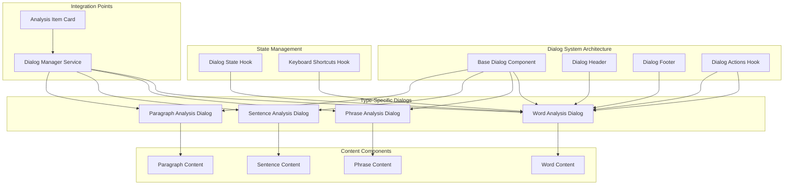

# Phân Tích và Thiết Kế Hệ Thống Dialog Cho Analysis Types

## 1. Phân Tích Cấu Trúc Hiện Tại

### 1.1. AnalysisItemCard Component
- **Vị trí**: `src/components/analysis/components/AnalysisItemCard.tsx`
- **Chức năng**: Hiển thị thông tin cơ bản của analysis item
- **Props chính**: `analysis`, `onClick`, `onAnalyze`, `onRemove`
- **Event handlers**: 
  - `onClick`: Xử lý khi click vào card
  - `onAnalyze`: Xử lý khi chọn "Phân tích chi tiết"
  - `onRemove`: Xử lý khi xóa analysis item
- **Layout**: Hỗ trợ 2 layout (default, compact) với cấu hình riêng cho từng type

### 1.2. Analysis Types
- **Word**: `word`, `phrase`, `sentence`, `paragraph`
- **Data structures**: Định nghĩa trong `src/components/analysis/types/analysis-types.ts`
- **Type guards**: `isWordAnalysis`, `isPhraseAnalysis`, `isSentenceAnalysis`, `isParagraphAnalysis`

### 1.3. Dialog Components Hiện Tại
- **AnalysisResultDialog**: Dialog hiển thị kết quả phân tích chi tiết
- **SmartVocabularyDialog**: Dialog thêm từ vào vocabulary
- **DeleteSessionDialog**: Dialog xóa session
- **Dialog UI Base**: Sử dụng Radix UI với các size variants

### 1.4. Vấn Đề Cải Thiện
- **AnalysisResultDialog**: Quá phức tạp, xử lý nhiều type trong một component
- **Khó mở rộng**: Mỗi type cần thêm chức năng riêng nhưng phải chung trong một dialog
- **Code duplication**: Logic cho từng type mixed trong cùng component
- **Testing khó**: Không thể test riêng từng type độc lập

## 2. Requirements Cho Dialog System Mới

### 2.1. Yêu Cầu Chức Năng
1. **Modular design**: Mỗi analysis type có dialog component riêng
2. **Consistent interface**: Chung interface cho tất cả dialog types
3. **Reusable components**: Các UI components có thể tái sử dụng
4. **Type safety**: Full TypeScript support với proper type guards
5. **State management**: Quản lý state một cách tập trung
6. **Performance**: Lazy loading và optimization
7. **Accessibility**: Full accessibility support
8. **Responsive**: Mobile-first design
9. **Animation**: Smooth transitions và micro-interactions
10. **Testing**: Easy unit và integration testing

### 2.2. Dialog Types Cần Thiết Kế
1. **WordAnalysisDialog**: Hiển thị chi tiết phân tích từ
2. **PhraseAnalysisDialog**: Hiển thị chi tiết phân tích cụm từ  
3. **SentenceAnalysisDialog**: Hiển thị chi tiết phân tích câu
4. **ParagraphAnalysisDialog**: Hiển thị chi tiết phân tích đoạn văn

### 2.3. Common Features Cho Tất Cả Dialogs
- View original text
- Export functionality (PDF, JSON, etc.)
- Print functionality
- Share functionality
- Fullscreen mode
- Resizable dialog
- Keyboard shortcuts
- Loading states
- Error handling
- Animation transitions

## 3. Thiết Kế Kiến Trúc Tổng Thể

### 3.1. File Structure Đề Xuất
```
src/components/analysis/dialogs/
├── common/
│   ├── BaseDialog.tsx              # Base dialog component
│   ├── DialogHeader.tsx           # Reusable header
│   ├── DialogFooter.tsx           # Reusable footer
│   ├── DialogActions.tsx          # Common action buttons
│   └── DialogUtils.ts            # Utility functions
├── word/
│   ├── WordAnalysisDialog.tsx     # Word-specific dialog
│   ├── WordAnalysisContent.tsx   # Word content display
│   └── WordAnalysisActions.tsx   # Word-specific actions
├── phrase/
│   ├── PhraseAnalysisDialog.tsx   # Phrase-specific dialog
│   ├── PhraseAnalysisContent.tsx # Phrase content display
│   └── PhraseAnalysisActions.tsx # Phrase-specific actions
├── sentence/
│   ├── SentenceAnalysisDialog.tsx  # Sentence-specific dialog
│   ├── SentenceAnalysisContent.tsx # Sentence content display
│   └── SentenceAnalysisActions.tsx # Sentence-specific actions
├── paragraph/
│   ├── ParagraphAnalysisDialog.tsx # Paragraph-specific dialog
│   ├── ParagraphAnalysisContent.tsx # Paragraph content display
│   └── ParagraphAnalysisActions.tsx # Paragraph-specific actions
├── hooks/
│   ├── useDialogState.ts        # Dialog state management
│   ├── useDialogActions.ts      # Dialog action handlers
│   └── useDialogKeyboard.ts    # Keyboard shortcuts
├── types/
│   ├── dialog-types.ts           # Dialog type definitions
│   └── dialog-interfaces.ts    # Dialog interfaces
└── index.ts                     # Export all dialogs
```

### 3.2. Component Architecture
- **BaseDialog**: Component base với common functionality
- **Type-specific dialogs**: Kế thừa từ BaseDialog
- **Content components**: Tách riêng logic hiển thị nội dung
- **Action components**: Tách riêng logic xử lý actions
- **Hook system**: Quản lý state và side effects

### 3.3. State Management Strategy
- **Local state**: useState cho dialog-specific state
- **Global state**: Context/Zustand cho dialog system state
- **Optimization**: useMemo và useCallback
- **Persistence**: LocalStorage cho user preferences

## 4. Integration Với AnalysisItemCard

### 4.1. Cách Tích Hợp
1. **Replace current onAnalyze**: Gọi dialog type phù hợp
2. **Add new props**: `onViewDetails`, `onEdit`, `onExport`
3. **Maintain compatibility**: Giữ lại existing API
4. **Gradual migration**: Có thể dùng song song existing và new system

### 4.2. Props Mới Cho AnalysisItemCard
```typescript
interface AnalysisItemCardProps {
  // Existing props
  analysis: AnalysisItem;
  onClick?: (analysis: AnalysisItem) => void;
  onAnalyze?: (analysis: AnalysisItem) => void;
  onRemove?: (analysisId: string, analysisType: AnalysisType) => void;
  compact?: boolean;
  showPhonetic?: boolean;
  truncateLength?: number;
  
  // New props for dialog system
  onViewDetails?: (analysis: AnalysisItem) => void;
  onEdit?: (analysis: AnalysisItem) => void;
  onExport?: (analysis: AnalysisItem, format: ExportFormat) => void;
  dialogSystem?: 'legacy' | 'new'; // Choose between systems
}
```

## 5. Technical Specifications

### 5.1. Interface Definitions
```typescript
// Base dialog interface
interface BaseAnalysisDialogProps {
  open: boolean;
  onOpenChange: (open: boolean) => void;
  analysis: AnalysisItem | null;
  analysisType: AnalysisType;
  className?: string;
}

// Type-specific interfaces
interface WordAnalysisDialogProps extends BaseAnalysisDialogProps {
  analysis: WordAnalysis | null;
  onPronounce?: (word: string) => void;
  onAddToVocabulary?: (word: WordAnalysis) => void;
}

interface PhraseAnalysisDialogProps extends BaseAnalysisDialogProps {
  analysis: PhraseAnalysis | null;
  onAnalyzeWords?: (words: string[]) => void;
}

interface SentenceAnalysisDialogProps extends BaseAnalysisDialogProps {
  analysis: SentenceAnalysis | null;
  onBreakdown?: (sentence: string) => void;
}

interface ParagraphAnalysisDialogProps extends BaseAnalysisDialogProps {
  analysis: ParagraphAnalysis | null;
  onSummarize?: (paragraph: string) => void;
}
```

### 5.2. Dialog State Management
```typescript
interface DialogState {
  openDialogs: Record<AnalysisType, boolean>;
  dialogData: Record<AnalysisType, AnalysisItem | null>;
  dialogStates: Record<AnalysisType, {
    loading: boolean;
    error: string | null;
    fullscreen: boolean;
    resizedWidth?: number;
  }>;
}

interface DialogActions {
  openDialog: (type: AnalysisType, data: AnalysisItem) => void;
  closeDialog: (type: AnalysisType) => void;
  updateDialogData: (type: AnalysisType, data: AnalysisItem) => void;
  setDialogLoading: (type: AnalysisType, loading: boolean) => void;
  setDialogError: (type: AnalysisType, error: string | null) => void;
}
```

### 5.3. Export Functionality
```typescript
type ExportFormat = 'pdf' | 'json' | 'csv' | 'txt';

interface ExportOptions {
  format: ExportFormat;
  includeMetadata: boolean;
  includeOriginalText: boolean;
  customTemplate?: string;
}
```

## 6. Implementation Strategy

### 6.1. Phase 1: Foundation
1. Tạo BaseDialog component
2. Tạo dialog types và interfaces
3. Tạo utility functions
4. Setup testing framework

### 6.2. Phase 2: Type-Specific Dialogs
1. Implement WordAnalysisDialog
2. Implement PhraseAnalysisDialog  
3. Implement SentenceAnalysisDialog
4. Implement ParagraphAnalysisDialog

### 6.3. Phase 3: Integration
1. Update AnalysisItemCard
2. Create dialog management hooks
3. Implement state management
4. Add keyboard shortcuts
5. Add animations và transitions

### 6.4. Phase 4: Polish
1. Performance optimization
2. Accessibility improvements
3. Mobile responsiveness
4. Documentation
5. Testing coverage

## 7. Mermaid Architecture Diagram



## 8. Benefits Của Thiết Kế Mới

### 8.1. Development Benefits
1. **Modularity**: Dễ maintain và extend
2. **Type Safety**: Full TypeScript support
3. **Testability**: Mỗi component có thể test độc lập
4. **Reusability**: Common components có thể tái sử dụng
5. **Performance**: Optimized cho từng use case
6. **Developer Experience**: Dễ phát triển và debug

### 8.2. User Experience Benefits
1. **Consistency**: Unified UX across all analysis types
2. **Performance**: Fast loading và smooth interactions
3. **Accessibility**: Full keyboard và screen reader support
4. **Responsive**: Works well trên all devices
5. **Features**: Rich functionality cho từng analysis type

### 8.3. Maintenance Benefits
1. **Scalability**: Dễ thêm analysis types mới
2. **Debugging**: Isolated issues cho từng type
3. **Updates**: Có thể update từng type độc lập
4. **Testing**: Targeted test cho từng component
5. **Documentation**: Clear structure cho team mới

## 9. Kế Hoạch Triển Khai

### 9.1. Timeline
- **Week 1**: Foundation và base components
- **Week 2**: Word và Phrase dialogs
- **Week 3**: Sentence và Paragraph dialogs  
- **Week 4**: Integration và testing
- **Week 5**: Polish và documentation

### 9.2. Risk Mitigation
1. **Backward compatibility**: Giữ lại existing API
2. **Gradual rollout**: Feature flag cho new system
3. **Testing**: Comprehensive test suite
4. **Performance monitoring**: Track metrics
5. **User feedback**: Collect và iterate

### 9.3. Success Metrics
1. **Code quality**: Test coverage > 90%
2. **Performance**: Dialog open time < 200ms
3. **Accessibility**: WCAG 2.1 AA compliance
4. **User satisfaction**: Rating > 4.5/5
5. **Developer productivity**: Reduce development time 30%